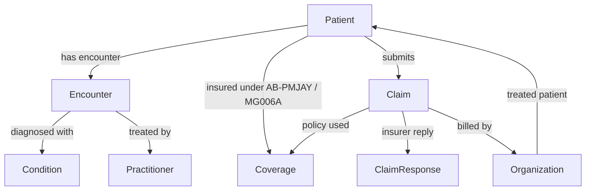

| Administrative | Clinical           | Financial            |
| -------------- | ------------------ | -------------------- |
| Patient        | Condition          | Claim                |
| Organization   | Observation        | ClaimResponse        |
| Practitioner   | Procedure          | Coverage             |
| Coverage       | Medication         | ExplanationOfBenefit |
| Encounter      | DiagnosticReport   |                      |
|                | AllergyIntolerance |                      |
|                | Immunization       |                      |
|                | CarePlan           |                      |

Right now you have the left and right columns. The middle column — the actual clinical data — is absent. That's what Observation, DiagnosticReport, and Procedure would fill in: lab values, vitals, imaging results, surgeries performed.

Think of it as a story of one hospital visit, told through different lenses:

## The Person

**Patient** — who the person is. Demographics only: name, gender, date of birth, address. No clinical information. Every other resource points back to Patient as the subject.

## The Visit

**Encounter** — the actual hospital visit. When did the patient walk in (period.start) and walk out (period.end)? What kind of visit was it (inpatient, outpatient, emergency)? Encounter is the container that ties the clinical event together — Condition, Observation, and Procedure all reference an Encounter to say "this was found/done during this visit."

## The Clinical Picture

**Condition** — what the patient was diagnosed with. The why they came to the hospital. Coded in SNOMED CT. In your data this is the varied field — Typhoid fever, Biliary colic, etc.

**Observation** — measurements and findings recorded during the visit. Blood pressure, lab results, temperature, blood glucose. Not in your current bundles, but this is where vitals and diagnostics live in a full FHIR dataset.

## The Money

**Claim** — the hospital's bill submitted to the insurer (AB-PMJAY). Says: "This patient had this procedure, it cost ₹1804, here's the pre-auth reference." References the Condition (diagnosis), the Coverage (insurance policy), and the Organization (who's billing).

**ClaimResponse** — the insurer's reply to the Claim. Says: "We approve ₹1529 of the ₹1804 claimed." Contains the outcome (complete/partial) and adjudication amounts.

**Coverage** — the patient's insurance policy. Links the patient to the scheme (AB-PMJAY) and the specific package (MG006A — "Enteric Fever"). The class.value field is what you use to filter patients by package.

## The Providers

**Organization** — the hospital that treated the patient and submitted the claim. Has a name, address, phone number.

**Practitioner** — the individual doctor who treated the patient. Referenced by Encounter.

## How they connect in your data:

In plain English for one record in your data:

_Mr. Feeney (Patient) was admitted on 12-Mar-2018 (Encounter) to Lowell General Hospital (Organization) and diagnosed with Pyrexia of unknown origin (Condition). He is covered under AB-PMJAY package MG006A (Coverage). The hospital billed ₹1804 for antibiotic therapy (Claim) and received approval for ₹1529 (ClaimResponse)._

That's the complete picture. Observation is the missing piece — in a richer dataset it would sit inside the Encounter and tell you the patient's temperature was 39.5°C, WBC count was elevated, etc., giving clinical evidence for the Condition diagnosis.

## Alternatives for ABAC

Field-level ABAC on the response attributes is arguably more important than SNOMED-level, and here's why:

SNOMED-level ABAC controls who you can query:

**"You can only fetch patients with Typhoid fever, not Salmonella infection"**

Field-level ABAC controls what you see about those patients:

"You can see the condition and admission date, but not the name, claim amount, or hospital"

The second is closer to what healthcare privacy regulations actually care about — HIPAA's minimum necessary principle, GDPR data minimisation. The fields in that response have very different sensitivity levels:

| High Sensitivity | Medium          | Low               |
| ---------------- | --------------- | ----------------- |
| patient_id       | admission_date  | condition_code    |
| name             | encounter_type  | condition_display |
| birth_date       | claim_amount    | condition_status  |
|                  | approved_amount | package_label     |
| hospital_name    |                 |                   |

### A realistic role breakdown:

| Role                | Can See                                                                   |
| ------------------- | ------------------------------------------------------------------------- |
| Clinical researcher | condition, admission_date, gender, birth_date — no PII, no financials     |
| Insurance auditor   | claim_amount, approved_amount, hospital_name, condition — no patient name |
| Epidemiologist      | condition, gender, birth_date only — fully anonymised                     |
| Platform admin      | everything                                                                |

They're not alternatives — they're complementary:

- #### **SNOMED-level** → gates which patient populations you can query
- #### **Field-level**→ gates what you see about those patients once you're in

## Where to enforce it:

Field-level is pure FastAPI response shaping — no FHIR query changes needed. Fetch the full record, then mask/drop fields based on the user's role before returning. The Go auth server would need to encode field permissions per role, or you define role→field mappings in the FastAPI layer itself.

In terms of implementation priority: field-level first, SNOMED-level second. Field-level protects against data leakage even if someone circumvents the SNOMED filter.
